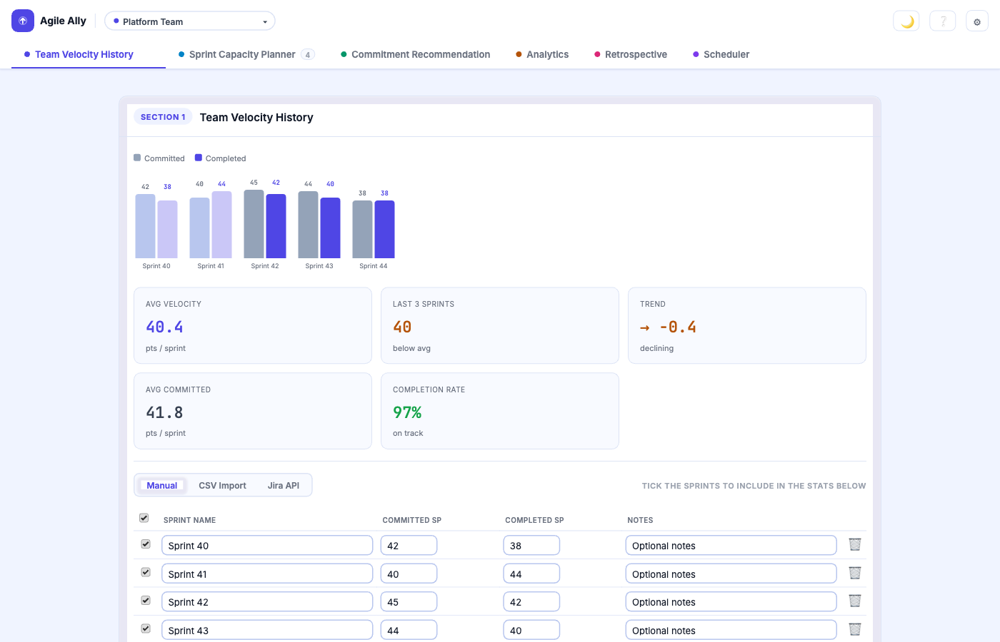
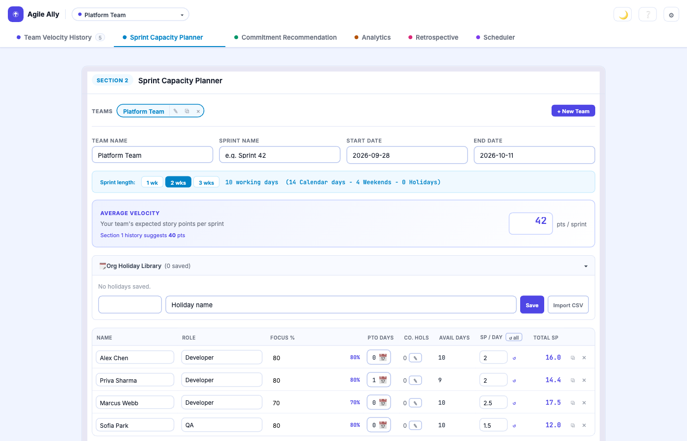
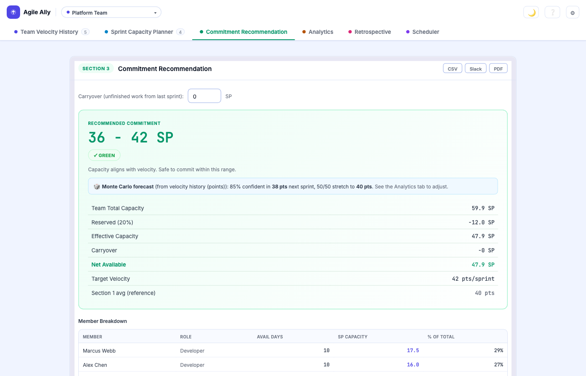

# Agile Ally

A zero-dependency, single-file agile toolkit for sprint planning, capacity estimation, velocity analytics, and ceremony scheduling. No build step, no backend, no install. Open `index.html` and go.



---

## Features

### Team Velocity History

Track historical sprint output across three input modes:

- **Manual** - enter sprint names and story points directly in a table
- **CSV Import** - drag and drop a Jira export; the tool auto-detects column names
- **Jira API** - connect with a Personal Access Token to load closed sprints automatically

A bar chart shows velocity trend (last 3 sprints highlighted), plus stat tiles for average velocity, last-3 average, and trend direction.

**CSV format expected:**
```
Sprint Name,Completed Points
Sprint 40,38
Sprint 41,45
```

---

### Sprint Capacity Planner



- Set sprint dates; working days are calculated automatically (excludes weekends)
- Choose a sprint length preset (1 / 2 / 3 weeks) or custom dates
- Build an Org Holiday Library: save recurring company holidays, import from CSV, or override per-member
- Add team members with: Name, Role, Focus %, PTO Days, Company Holidays, SP/Day
- Available Days = Working Days - PTO - Company Holidays
- Member SP = Available Days x SP/Day x (Focus% / 100)
- Set a reserved capacity % (default 20%) for ceremonies and unplanned interruptions

---

### Commitment Recommendation



- Generates a lower-upper SP range based on effective capacity and average velocity
- Accounts for carryover (unfinished work from the previous sprint)
- Assigns a risk level: GREEN / AMBER / RED with rationale
- Per-member breakdown table sorted by SP capacity
- Monte Carlo forecast with confidence percentage
- Sprint notes textarea for risks and assumptions

---

### Analytics

Multi-sprint trend analysis: velocity over time, commitment accuracy, completion rates, and sprint-on-sprint comparisons. Helps surface patterns across teams.

---

### Retrospective

Structured retro board with What Went Well / What Didn't / Action Items columns, saved per sprint and per team.

---

### Scheduler

Ceremony rotation planner. Assigns facilitators across the team for standups, retros, refinements, and sprint reviews. Leave-aware, least-loaded scheduling engine.

---

## How to run locally

No build step required. Open `index.html` directly in a browser, or serve with any static file server:

```bash
python3 -m http.server 8000
```

Then open `http://localhost:8000`.

---

## Jira API connection

1. Go to Section 1 > Jira API tab
2. Enter your Jira base URL (e.g. `https://yourorg.atlassian.net`)
3. Generate a Personal Access Token at `https://id.atlassian.com/manage-profile/security/api-tokens`
4. Enter your Board ID (visible in the Jira board URL: `/boards/42` means Board ID is `42`)
5. Click **Fetch Sprints**, select the sprints to include, then click **Load Selected**

> Atlassian Cloud blocks direct browser requests (CORS). If you see a connection error, run `npx cors-anywhere` in a terminal to start a local proxy on port 8080, then click **Retry via proxy**.

The PAT is never saved to localStorage. Only the base URL and board ID are persisted.

---

## Export options

| Format | How to use |
|---|---|
| PDF / Print | Click PDF in the sticky bar or Section 3 header. Hides UI controls and prints a clean report. |
| CSV | Downloads a structured CSV with velocity history, per-member capacity, and recommendation figures. |
| Slack | Copies a formatted message to the clipboard. Paste directly into a Slack channel. |

On mobile, all exports are behind an **Export** button that opens a bottom sheet.

---

## How to reset data

1. Click the gear icon (top-right corner)
2. Under **Data Management**, use the clear buttons for velocity or team data
3. To wipe everything, click **Reset all data** and type `RESET` to confirm

---

## Backup and restore

Use **Settings > Export JSON backup** to download a full snapshot of all localStorage data. To restore, use **Settings > Import JSON backup** and select the file.

---

## Storage keys (localStorage)

| Key | Contents |
|---|---|
| `hudl_velocity` | Sprint history and active input mode |
| `hudl_team` | Team name, sprint name, dates, reserved %, member list |
| `hudl_sprint` | Carryover SP, sprint notes |
| `hudl_holidays` | Org holiday library |
| `hudl_jira` | Jira base URL and board ID (never the PAT) |

---

## License

MIT. See [LICENSE](LICENSE).
